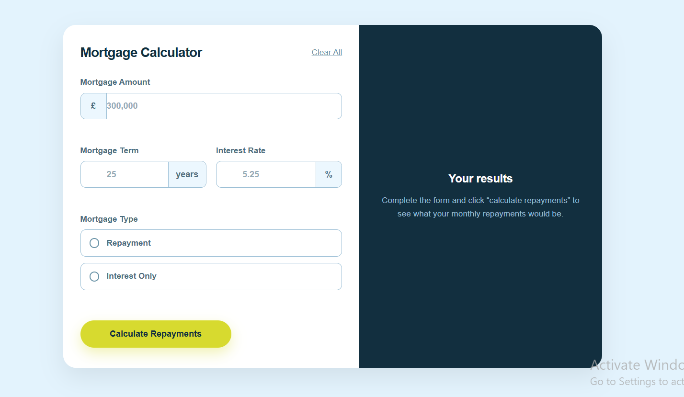

# Mortgage Repayment Calculator
This is a responsive mortgage calculator built with HTML, CSS, and JavaScript. This project allows users to estimate their monthly repayments and total loan cost based on their inputs.
# Live Demo
- View Live Project
- GitHub Repository

# Preview

# Features
 Calculate monthly repayments and total repayment
 Supports:
Repayment mortgage
Interest-only mortgage
Form validation with error messages
Fully responsive design (mobile & desktop)
Keyboard accessible form
Interactive UI (hover & focus states)

# Built With
HTML5 (Semantic markup)
CSS3 (Flexbox, Grid, Custom properties)
JavaScript (DOM manipulation, validation, calculations)

# What I Learned
Structuring clean and scalable HTML
Building responsive layouts using Flexbox & Grid
Creating custom form inputs and UI states
Implementing real-world financial calculations in JavaScript
Handling form validation and user feedback

# How It Works
User inputs:
Mortgage amount
Term (years)
Interest rate
Mortgage type
JavaScript calculates:
Monthly repayment
Total repayment
Results are displayed dynamically

# Project Structure
project-folder/ │── index.html │── styles.css │── script.js │── assets/ │── README.md

# Future Improvements
Add smooth animations for better UX
Improve accessibility (ARIA attributes)
Add currency selection
Add real-time calculation while typing

 # Author

Dieudonne Lusolo

- GitHub: [@Dieudo_Lus](https://github.com/mulongeshadieudonne17-alt)  
- Frontend Mentor: [View Project](https://github.com/FreeDev-Group/Mortgage_repayment_calculator_Dieudo)

# Challenge Source

This project is based on a challenge from
- https://www.frontendmentor.io/challenges/mortgage-repayment-calculator-Galx1LXK73
